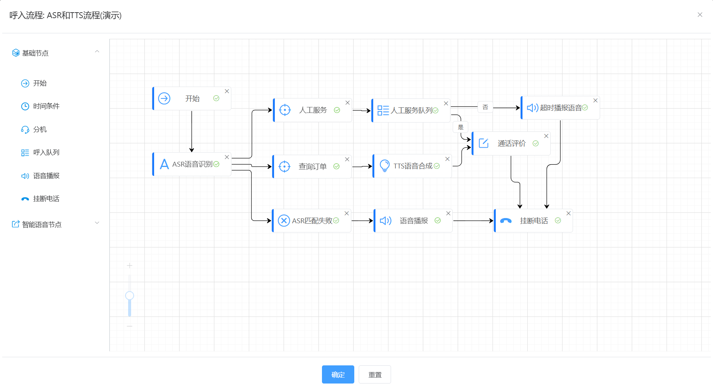

# pcswitch

#### Introduction

- PCSwitch call system, permanently free to use, supports intelligent robots (using Deepseek interface), ASR (speech recognition), TTS (speech synthesis), web interface (accessing other systems), webRTC, Visual incoming call process management, voice robots webRTC、IVR、 Inbound queue, inbound process visualization management, call evaluation, IP whitelist, customizable fields for customer information, and more
- Official website:[ https://www.pcswitch.cn ]( https://www.pcswitch.cn )
- Trial URL:[ https://demo.pcswitch.cn ]( https://demo.pcswitch.cn )


#### Software Architecture

- Front end: using Vue+elementUI
- Backend: Developed using Golang language
- Bottom layer: Adopting Freeswitch and undergoing secondary development
- Data layer: using Redis, Mariadb, and MongoDB


### System functions
1. Support intelligent robots (using Deepseek interface) and web interfaces (accessing other systems)
2. Support intelligent outbound calls (modular visual management) and batch scheduled outbound calls
3. Supports ASR (speech recognition), TTS (speech synthesis), and customizable speech robots
4. Supports multiple client types, including webRTC and SIP clients
5. Support static and dynamic seating
6. Supports multi tenant mode, the free version is only open to one organization
7. Support IVR, incoming queue, time judgment, IP whitelist, call evaluation, automatic addition of 0 to remote numbers, etc
8. The incoming call rule adopts modular visual configuration, which is easy to operate
9. Support custom customer information, allowing for the addition, reduction, and modification of field information at will
10. The call record table adopts an automatic sorting design, and a single table can accommodate 2 billion pieces of data

#### Installation tutorial
1. The installation package download address is: https://pan.baidu.com/s/1ZvH6sjthjIcqa2Ygx76N8A?pwd=6t59
2. It is recommended to install using CentOS or Rocky operating systems
3. Download the pcswitch installation package
4. Extract pcswitch, for example, to the/opt directory
5. Run the following command to install:
./pcs_cli install
6. After successful installation, enable system services
./pcs_cli start
7. Stop all services
./pcs_cli stop
8. View Help Command
./pcs_cli -h
9. Certificate replacement method

```
1) Replace web certificate
The certificate storage path is: config/web/char
You can replace 'server. key' and 'server. char' with new certificates, please keep the file names unchanged!  
Note: If you want to change the certificate file name, you need to replace the certificate name in the config/web/ginx.conf file together
Restart web service
#. /pcs_cli restart web
Check if the certificate is valid

2) Replace core certificate
The certificate storage path is: data/core/credits
Delete dtls strp.pem and wss.tem
Merge the certificate key and CRT into: wss.tem, and store it in the data/core/credits directory as follows:
#cat server.key server.crt > wss.pem
Restart service
#. /pcs_cli restart core

```
10. Intelligent voice configuration
At present, only Alibaba Cloud Intelligent Voice has been connected, and Alibaba Cloud's "Intelligent Voice Interaction" service needs to be activated
1) Method for creating AccessKey ID and AccessKey Secret
[Create AccessKey Alibaba Cloud document]（ https://help.aliyun.com/zh/ram/user-guide/create-an-accesskey-pair?spm=a2c4g.11186623.help -menu-28625.d_2_6_0.72f52c6aBsQZDH)
2) The method to obtain Appkey is to first create a project, and then access it on the project management page
[Alibaba Cloud Document]（ https://help.aliyun.com/zh/isi/getting-started/manage-projects?spm=a2c4g.11186623.help -menu-30413.d_1_1.54f220d0aZccXv)
3) After creation, it can be called in the "incoming call process" and voice file
11. Intelligent robots
The intelligent robot adopts the Deepseek interface. However, due to the lack of stream mode and the relatively long return time of Deepseek, the intelligent robot currently needs to wait for some time during conversations. It is recommended to use private deployment of DeepSeek for production environments, while training models for specific environments.

#### Instructions for use

1. This version is a free version, and the system has been initialized and configured after installation, including 3 extensions, etc
2. The system defaults to using private certificates, which users can replace with official certificates
3. The system does not have a gateway configured by default, and users need to configure the gateway themselves
4. Default account/password: admin/a2f55ef976bcf8b0ae

#### System Display
1. Login interface

2. WebRTC registration

3. Pop up screen for incoming calls

4. Backend management

5. Visualization configuration of incoming call rules

6. ASR and TTS processes

7. Intelligent robots

8. Intelligent outbound call


####Problem feedback

-WeChat:! [Input Image Description] (images/wx. png)
-Email address: kf@pcswitch.cn


