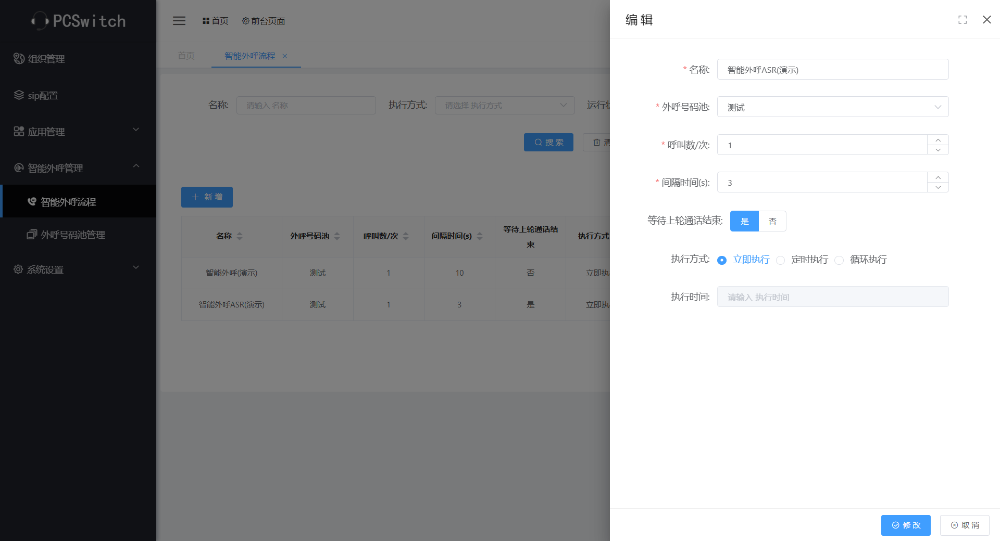
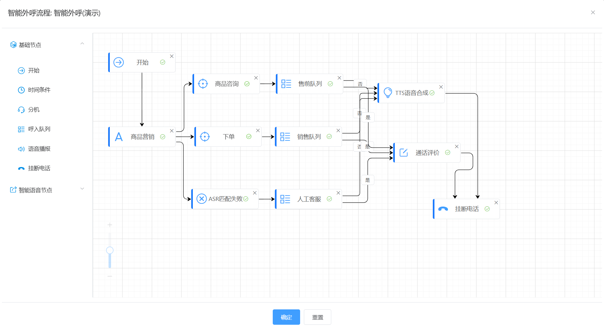

# pcswitch

#### Introduction

- PCSwitch Call System, permanently free to use, supports smart robots (DeepSeek interface), ASR (Speech Recognition), TTS (Text-to-Speech), intelligent outbound calling (modular visual management), batch outbound calling, web interfaces (integration with other systems), WebRTC, inbound call flows (modular visual management), voice robots, IVR, inbound call queues, inbound call flow visual management, online voice customer service, call evaluation, call transfer, whitelists, blacklists, customizable customer profile fields, and more
- Official website:[ https://www.pcswitch.cn ]( https://www.pcswitch.cn )
- Trial URL:[ https://demo.pcswitch.cn ]( https://demo.pcswitch.cn )


#### Software Architecture
- Front end+backend+underlying architecture, easy to expand, supports high concurrency
- Data layer: using Redis, Mariadb, and MongoDB


### System functions
1. Support for intelligent robots (using DeepSeek interface) and web interfaces (for accessing other systems)
2. Supports ASR (Automatic Speech Recognition) and TTS (Text-to-Speech), with customizable voice robots
3. Supports online voice customer service and custom call forwarding
4. Supports IVR, inbound call queues, time-based routing, whitelists, and blacklists
5. Supports multiple client types, including: WebRTC and SIP clients
6. Supports static and dynamic seats
7. Supports multi-tenancy mode, with the free version only allowing one organization
8. The inbound call rules adopt a visual configuration for convenient operation
9. Supports custom customer information, allowing free addition, deletion, and modification of field data

#### Installation tutorial
1. The installation package download address is: https://pan.baidu.com/s/1ZvH6sjthjIcqa2Ygx76N8A?pwd=6t59
2. It is recommended to use CentOS 7.9 operating system for installation
3. Download the pcswitch installation package
4. Extract pcswitch, for example, to the/opt directory
5. Run the following command to install:
./pcs_cli install
6. After successful installation, enable system services
./pcs_cli start
7. Stop all services
./pcs_cli stop
8. View Help Command
./pcs_cli -h
9. Certificate replacement method

```
1) Replace web certificate
The certificate storage path is: config/web/char
You can replace 'server. key' and 'server. char' with new certificates, please keep the file names unchanged!  
Note: If you want to change the certificate file name, you need to replace the certificate name in the config/web/ginx.conf file together
Restart web service
#. /pcs_cli restart web
Check if the certificate is valid

2) Replace core certificate
The certificate storage path is: data/core/credits
Delete dtls strp.pem and wss.tem
Merge the certificate key and CRT into: wss.tem, and store it in the data/core/credits directory as follows:
#cat server.key server.crt > wss.pem
Restart the service
#. /pcs_cli restart core

```
10. Intelligent voice configuration
At present, only Alibaba Cloud Intelligent Voice has been connected, and Alibaba Cloud's "Intelligent Voice Interaction" service needs to be activated
1) Method for creating AccessKey ID and AccessKey Secret
[Create AccessKey Alibaba Cloud document]（ https://help.aliyun.com/zh/ram/user-guide/create-an-accesskey-pair?spm=a2c4g.11186623.help -menu-28625.d_2_6_0.72f52c6aBsQZDH)
2) The method to obtain Appkey is to first create a project, and then access it on the project management page
[Alibaba Cloud Document]（ https://help.aliyun.com/zh/isi/getting-started/manage-projects?spm=a2c4g.11186623.help -menu-30413.d_1_1.54f220d0aZccXv)
3) After creation, it can be called in the "incoming call process" and voice file
11. Intelligent robots
The intelligent robot adopts the Deepseek interface. However, due to the lack of stream mode and the relatively long return time of Deepseek, the intelligent robot currently needs to wait for some time during conversations. It is recommended to use private deployment of DeepSeek for production environments, while training models for specific environments.

#### Instructions for use

1. This version is a free version, and the system has been initialized and configured after installation, including 3 extensions, etc
2. The system defaults to using private certificates, which users can replace with official certificates
3. The system does not have a gateway configured by default, and users need to configure the gateway themselves
4. Default account/password: admin/a2f55ef9-rH19Mo7HGo(

#### System Display
1. Login interface

2. WebRTC registration

3. Backend management

4. Visualization configuration of incoming call rules

5. ASR and TTS processes

6. Intelligent robots

7. Web interface

8. Intelligent Outbound Calling


9. Online Voice Customer Service

#### Problem feedback

- WeChat:
- Email address: kf@pcswitch.cn


