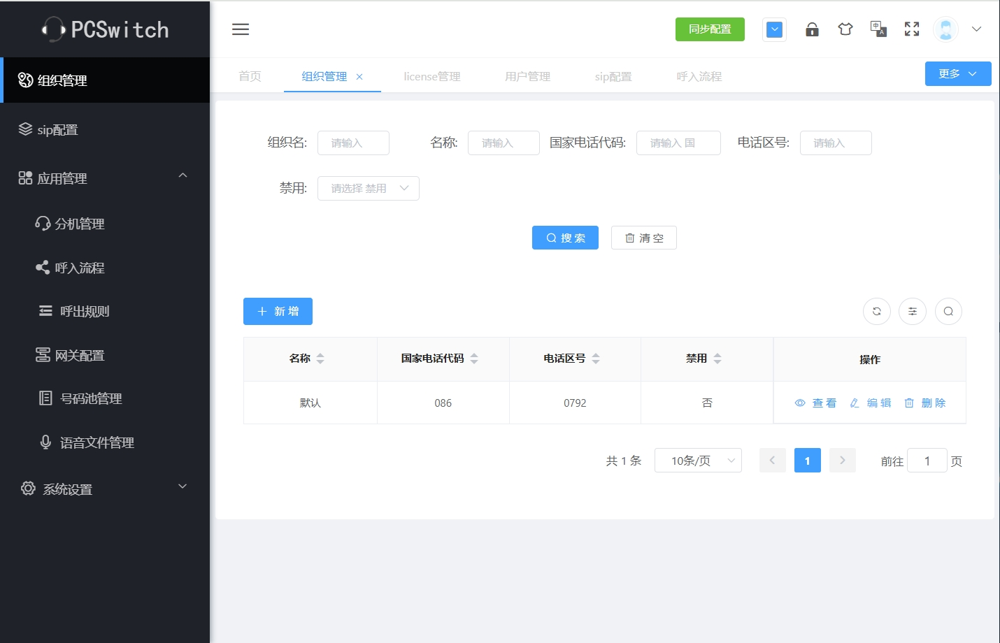
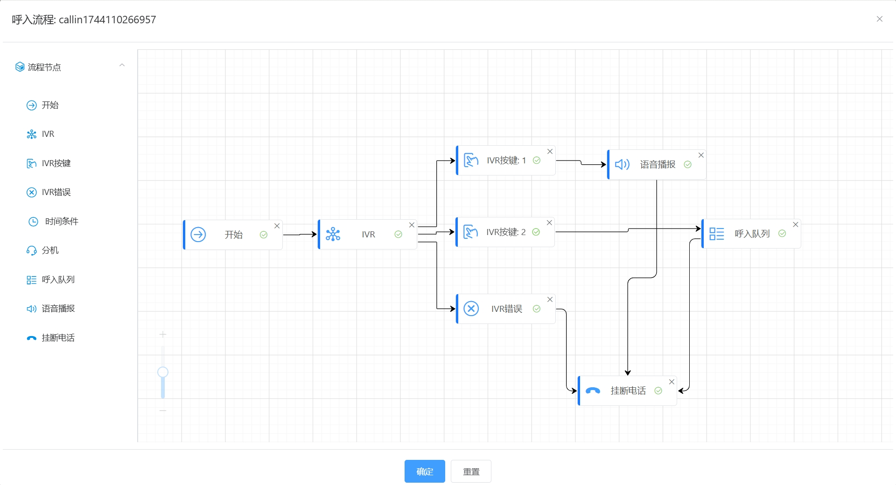

# pcswitch

#### 介绍

- pcswitch呼叫系统，永久免费使用，支持webRTC、IVR、呼入队列、呼入规则可视化配置、客户资料可自定义字段等等
- 官网：[https://www.pcswitch.cn](https://www.pcswitch.cn)
- 试用网址：[https://demo.pcswitch.cn](https://demo.pcswitch.cn)

#### 软件架构

- 前端：采用vue+elementUI
- 后端：采用golang语言开发
- 底层：采用freeswitch同时进行二次开发

### 系统功能
1. 支持多种客户端类型，包括：webRTC、sip客户端
2. 支持静态坐席、动态坐席
3. 支持多租户模式，免费版本只开放了1个组织
4. 支持IVR、呼入队列、时间判断等
5. 呼入规则采用可视化配置，操作方便
6. 客户资料可自定义字段

#### 安装教程
1. 安装包下载地址为：https://pan.baidu.com/s/1ZvH6sjthjIcqa2Ygx76N8A?pwd=6t59
2. 推荐使用centos7.9操作系统安装
3. 下载pcswitch安装包
4. 将pcswitch解压，比如解压到：/opt目录中
5. 运行如下命令安装：
   ./pcs_cli install
6. 安装成功后，开启系统服务
   ./pcs_cli start
7. 停止所有服务
   ./pcs_cli stop
8. 查看帮助命令
   ./pcs_cli -h
9. 证书替换方法

-   1）替换web证书
-      证书存放路径为：config/web/cert
-      可以将server.key、server.cert替换为新的证书，请保持文件名不变! 
-       注：如果更改证书文件名，需要将config/web/nginx.conf文件中的证书名一起更换
-      重启web服务
-       ./pcs_cli restart web
-      查看证书是否生效
- 
-   2）替换core证书
-      证书存放路径为：data/core/certs
-      删除dtls-strp.pem、wss.pem
-      将证书key和crt合并为：wss.pem，然后存放到data/core/certs目录下，如下：
       #cat server.key server.crt > wss.pem
-      重启服务
-       ./pcs_cli restart core

#### 使用说明

1.  此版本为免费版本，安装后系统已进行了初始化配置，包括3个分机等
2.  系统默认使用了私有证书，用户可替换为正式证书
3.  系统默认没有配置网关，用户需要自行配置下网关
4.  默认账号/密码：admin/a2f55ef976bcf8b0ae

#### 系统展示
1. 登录界面

2. webRTC注册

3. 后台管理

4. 呼入规则可视化配置

#### 问题反馈
邮箱地址：kf@pcswitch.cn

